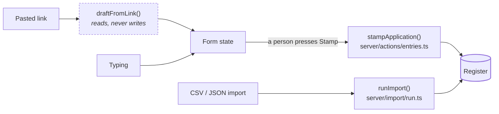
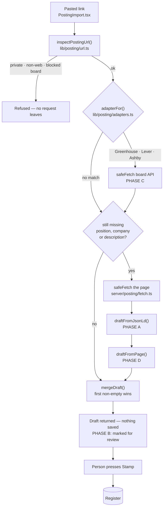
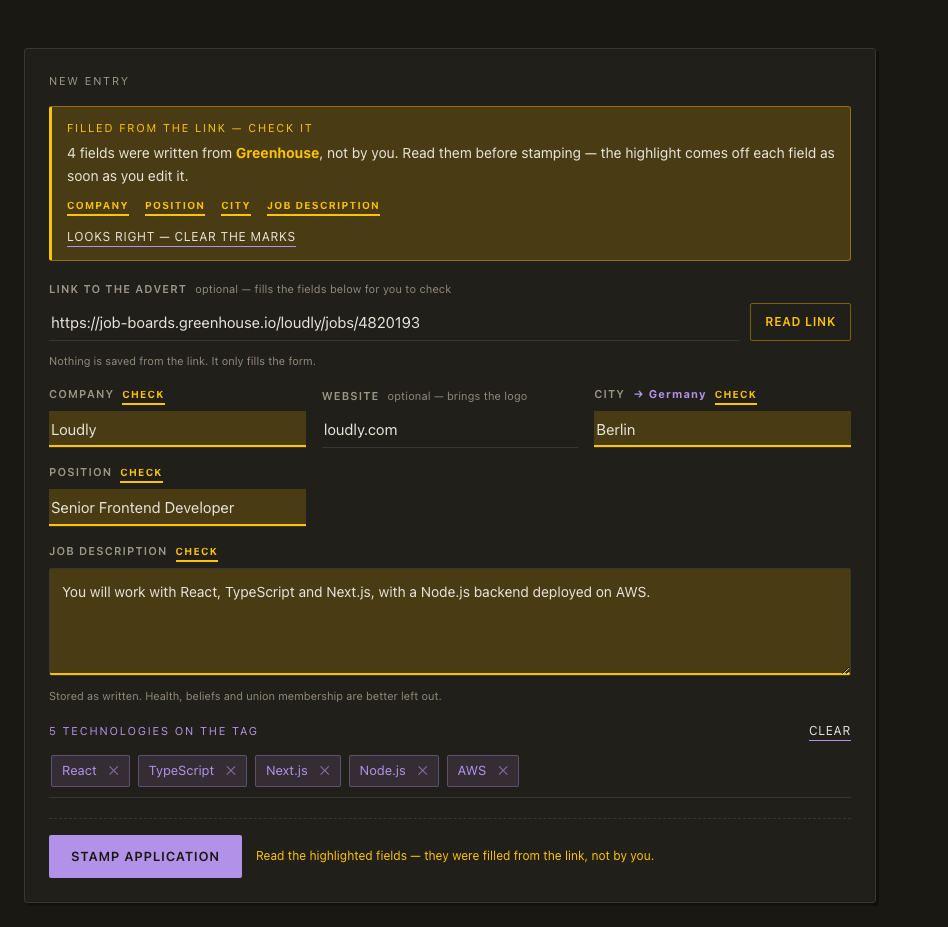
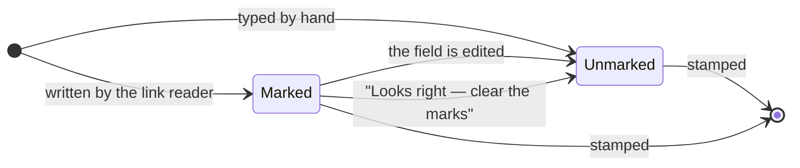
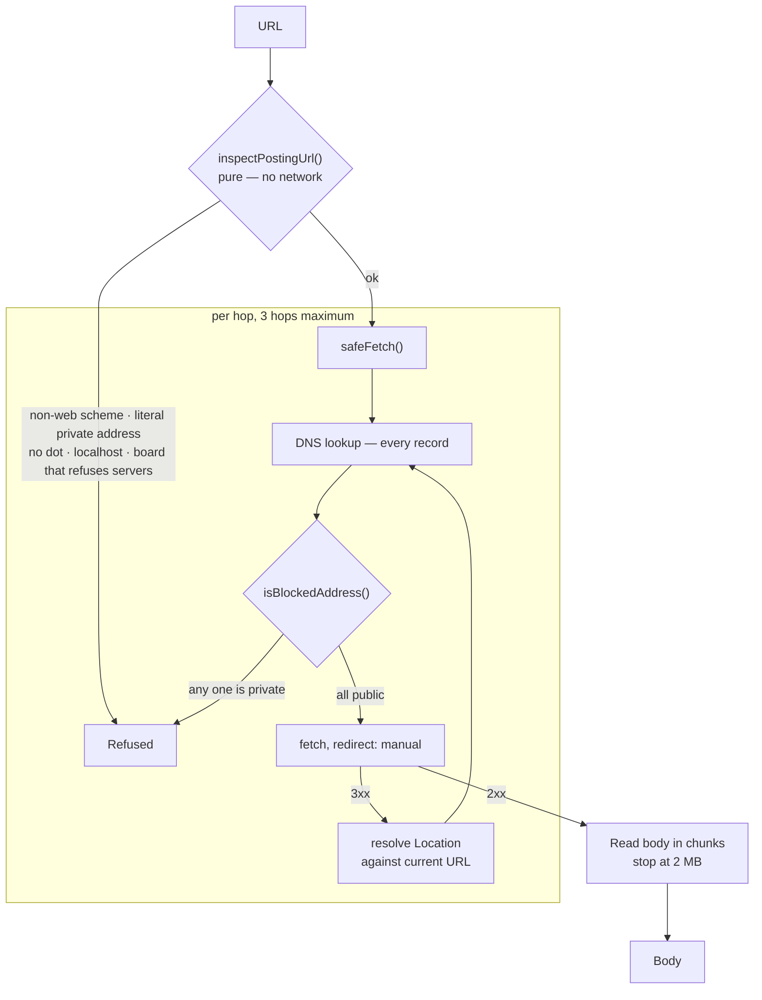
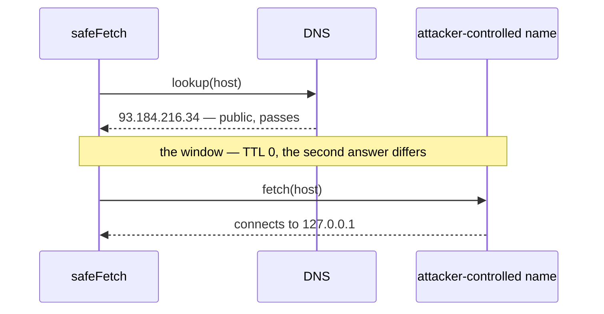

# The entry form

How a job application gets into the register, and what each part of the form is
for. Written for whoever changes it next.

> **Maintenance rule.** This document is versioned with the code it describes and
> is enforced by `src/lib/posting/documentation.test.ts` — architecture rule 2.
> Changing the form or the link pipeline means changing this file in the same
> commit. See [Keeping this document true](#keeping-this-document-true) for what
> the test checks and why those things and not others.

---

## The one invariant

**Only a person writes to the register.**

Everything below exists to make filling an entry faster. None of it may create
an entry. The link reader produces a _draft_ and stops; `stampApplication` in
`src/server/actions/entries.ts` is the only path to a row, and it runs because
somebody pressed a button.



Two paths reach the register: `stampApplication`, behind the Stamp button, and
`runImport`, behind a deliberate file upload. The link reader is neither — it
ends at the form.

`stampApplication` also emits one analytics count, `first_entry_stamped`, and
only when the new row is Nº 1 — the last step of the funnel in section 3 of the
brief. It carries no properties and no field values; failing to send it can
never fail the stamp. See `src/lib/analytics/config.ts` for why the
instrumentation is built the way it is.

This is not caution for its own sake. A docket is a numbered register of things
awaiting a decision, and its value is that every line in it was put there on
purpose. A register that fills itself is a scrape, and a scrape with a wrong
title in it is worse than an empty field — the wrong value looks exactly like a
right one forever after.

---

## Anatomy

`src/components/docket/StampForm.tsx` is the whole form. It is a client
component holding one `react-hook-form` instance validated by
`entryInputSchema` (`src/lib/validation/entry.ts`), and it submits to the
`stampApplication` server action.

| Field            | Required | Notes                                                                      |
| ---------------- | -------- | -------------------------------------------------------------------------- |
| `company`        | yes      | Free text.                                                                 |
| `website`        | no       | Normalised to a bare host by `normalizeDomain`; drives the company logo.   |
| `position`       | yes      | Free text.                                                                 |
| `city`           | no       | Autocompleted from the local city base; selecting one deduces the country. |
| `country`        | no       | Written by the city field or by the link reader, not typed directly.       |
| `jobDescription` | no       | The pasted advert. Feeds the tag detector.                                 |
| `notes`          | no       | Free text.                                                                 |
| `tags`           | yes      | At least one. Derived — see below.                                         |
| `timezone`       | —        | Taken from the browser at submit time.                                     |

Two fields store whatever the person types and nothing more: `notes` and
`jobDescription`. Both carry `FreeTextCaution`, which says so, next to the box —
GDPR art. 9 treats health, beliefs and union membership under a stricter regime
than the rest of the register, and what is never typed never has to be
protected.

### Tags are derived, not typed

`tags` is the one required field nobody fills in directly. It is computed on
every render:

```
detectStack(jobDescription) ─┐
dismissed (removed by hand) ─┼─→ resolveTags() → tags
manual    (added by hand)   ─┘
```

`detectStack` (`src/lib/stack-detector/index.ts`) is pure string matching over a
dictionary of technologies — no model, no network, no clock. It lowercases the
haystack, walks aliases longest-first so `React Native` claims its span before
`React` is tried, and refuses matches that begin or end mid-word so `java` never
fires inside `javascript`.

`dismissed` and `manual` hold the edits _on top of_ the detector's output rather
than replacing it. That is what stops a re-paste from silently resurrecting a
tag the user removed.

### `entryInputSchema` runs twice

The same schema is applied at two points, for two different reasons:

```ts
// StampForm.tsx — in the browser, so the person sees the error next to the field
useForm({ resolver: zodResolver(entryInputSchema) });

// entries.ts — on the server, because this is the check
const parsed = entryInputSchema.safeParse(input);
if (!parsed.success) return { ok: false, error: … };
```

The client copy is a convenience. The server copy is the check — a server action
is a public endpoint reachable by anyone who can craft a POST, whatever button
appears to call it. Removing the browser copy degrades the experience; removing
the server copy removes the validation.

---

## The link pipeline

Paste the URL of a job advert; the form fills itself in and marks what it
filled. Four phases were implemented (A–D). A fifth, an LLM fallback, was
scoped, costed and **deliberately not built** — see
[What was not built](#what-was-not-built).



Two requests leave the server per paste, at most.

### The merge rule holds the whole thing together

Every phase returns a `PostingPartial` — a partial record of the six fields.
`mergeDraft` (`src/lib/posting/merge.ts`) folds them in order, **first non-empty
value wins**, and the order is most-to-least trustworthy:

1. the board's own API (phase C)
2. the page's structured data (phase A)
3. what the markup says about itself (phase D)

A later phase can only fill a gap. It can never overwrite. This is the reason it
is safe to have a heuristic layer at all, and the reason an adapter for a board
whose response shape cannot be verified from here is a reasonable thing to ship:
if it is wrong, it contributes nothing, and the phase below it answers instead.

Worked example. A Greenhouse link where the board API knows the title and the
description, the page's structured data knows the employer, and the markup
contributes only the host:

| Field            | ① Greenhouse (phase C) | ② structured data (A) | ③ page text (D)  | **Merged**                  |
| ---------------- | ---------------------- | --------------------- | ---------------- | --------------------------- |
| `position`       | `Senior Frontend Dev`  | `Careers \| Loudly`   | `Careers`        | **① `Senior Frontend Dev`** |
| `company`        | —                      | `Loudly`              | `Loudly Careers` | **② `Loudly`**              |
| `website`        | —                      | —                     | `loudly.com`     | **③ `loudly.com`**          |
| `city`           | `Berlin`               | `Berlin`              | —                | **① `Berlin`**              |
| `country`        | —                      | —                     | —                | **`Germany`** ← deduced     |
| `jobDescription` | `You will work with…`  | `You will work with…` | (nav chrome)     | **① `You will work with…`** |

Note rows 1 and 6: phase D held a plausible-looking but wrong value in both, and
was never consulted because a better layer had already answered. That is the
protection, stated as a table.

`mergeDraft` also does the tidying every phase would otherwise repeat:

| Step                         | Effect                                          |
| ---------------------------- | ----------------------------------------------- |
| Whitespace collapse          | `"  Senior   Dev "` → `"Senior Dev"`            |
| Short-field cap              | 160 characters                                  |
| Description cap              | 12 000 characters, ellipsis appended            |
| `normalizeDomain` on website | `https://www.loudly.com/careers` → `loudly.com` |
| City → country deduction     | `Berlin` → country `Germany`, if still empty    |

The deduction is the same one the city field performs when a person types, and
it never overrides a country the advert stated itself.

### Module map

| Module                                    | Phase | Role                                                                                                                                               |
| ----------------------------------------- | ----- | -------------------------------------------------------------------------------------------------------------------------------------------------- |
| `src/lib/posting/types.ts`                | —     | `PostingField`, `PostingPartial`, `PostingDraft`, failures.                                                                                        |
| `src/lib/posting/net.ts`                  | A     | Address ranges a user-chosen fetch must never reach.                                                                                               |
| `src/lib/posting/url.ts`                  | A     | Everything decidable about a URL without the network.                                                                                              |
| `src/lib/posting/html.ts`                 | A     | Entity decoding, tag stripping, `<script type=ld+json>`, meta.                                                                                     |
| `src/lib/posting/jsonld.ts`               | A     | `schema.org/JobPosting` → partial.                                                                                                                 |
| `src/lib/posting/adapters.ts`             | C     | Board recognition, endpoints, per-board parsers.                                                                                                   |
| `src/lib/posting/heuristics.ts`           | D     | What the page declares about itself.                                                                                                               |
| `src/lib/posting/location.ts`             | C, D  | One free-text place string → city + country.                                                                                                       |
| `src/lib/posting/merge.ts`                | —     | Precedence, tidying, city → country deduction.                                                                                                     |
| `src/lib/posting/index.ts`                | —     | Barrel. The public surface of the pure half; import from here rather than reaching into a file, so a module can be split without touching callers. |
| `src/server/posting/fetch.ts`             | A     | The guarded fetch. The only outbound call.                                                                                                         |
| `src/server/posting/resolve.ts`           | —     | Orchestrates the phases into one result.                                                                                                           |
| `src/server/actions/posting.ts`           | —     | Auth, input limits, throttle. Writes nothing.                                                                                                      |
| `src/components/docket/PostingImport.tsx` | B     | The paste box.                                                                                                                                     |
| `src/components/docket/DraftReview.tsx`   | B     | The notice.                                                                                                                                        |
| `src/components/docket/StampForm.tsx`     | B     | Holds `marked`, applies the draft, submits.                                                                                                        |

Everything under `src/lib/posting/` is pure: no network, no clock, no DOM. That
is what makes the parsing testable without a socket, and it is why the fetch
lives in `src/server/` instead.

---

---

### Phase A — safe fetch and structured data

**`src/lib/posting/url.ts`, `src/server/posting/fetch.ts`,
`src/lib/posting/html.ts`, `src/lib/posting/jsonld.ts`,
`src/lib/posting/net.ts`**

This phase carries the feature. Google requires a `schema.org/JobPosting` block
to index a vacancy in Google Jobs, so Greenhouse, Lever, Ashby, Workday,
Personio, SmartRecruiters and most careers pages built in the last decade
publish one — containing exactly the fields the register asks for. Reading it is
neither scraping nor inference: it is the publisher's own machine-readable copy
of the advert.

`draftFromJsonLd` handles what the format actually looks like in the wild rather
than what the spec suggests:

- postings nested inside `@graph`, `mainEntity`, `itemListElement` or `item`
- `@type` given as a string or as an array
- `jobLocation` as a `Place`, as an array of them, or the address inline
- `description` containing HTML, which `stripTags` flattens
- a page shipping several blocks — the one answering the most fields wins
- a malformed block sitting next to a good one, which is skipped, never thrown

A block as it arrives, and what `draftFromPosting` takes from it:

```json
{
  "@context": "https://schema.org",
  "@type": "JobPosting",
  "title": "Senior Frontend Developer",
  "description": "<p>You will work with <b>React</b>, TypeScript and Next.js.</p>",
  "hiringOrganization": {
    "@type": "Organization",
    "name": "Loudly",
    "sameAs": "https://www.loudly.com/"
  },
  "jobLocation": {
    "@type": "Place",
    "address": {
      "@type": "PostalAddress",
      "addressLocality": "Berlin",
      "addressCountry": "Germany"
    }
  }
}
```

```ts
{
  position:       "Senior Frontend Developer",
  company:        "Loudly",
  website:        "loudly.com",              // normalizeDomain(sameAs)
  city:           "Berlin",
  country:        "Germany",
  jobDescription: "You will work with React, TypeScript and Next.js.",  // stripTags
}
```

One deliberate omission: `addressCountry` is allowed to be a two-letter code, and
a code is not a country name. Given `"addressCountry": "DE"` the field comes back
empty rather than putting `DE` in a column that holds `Germany`.

`src/lib/posting/html.ts` does the reading with regexes and no parser
dependency. For six fields off a page that is already required to publish them
as structured data, a DOM implementation would be several hundred kilobytes
bought in order to run regexes anyway. Every function there is conservative:
what it cannot read confidently returns empty and the caller falls through.

### Phase B — the review step

**`src/components/docket/PostingImport.tsx`,
`src/components/docket/DraftReview.tsx`, and the `marked` state in
`src/components/docket/StampForm.tsx`**

The reading is not the feature. This is.

A draft arrives **marked**: `StampForm` holds `marked: PostingField[]`, the
fields a link filled that the person has not looked at yet. Three things carry
it, and they are three on purpose:

1. **`DraftReview`** — a notice above the form saying how many fields were
   written, **where they were read** (`Greenhouse`, `structured data`, …), and
   naming each one.
2. **The highlighter** — `.marked` on each filled control, plus a textual
   `check` flag on its label. Colour is never the only carrier of the
   information; the label says it in words, and a `forced-colors` fallback keeps
   an outline when the OS drops custom colour entirely.
3. **The footer note** — replaces "the date and time are recorded
   automatically" with "read the highlighted fields — they were filled from the
   link, not by you" while any mark remains.


The same state on the dark ground, where the gold becomes text and border
instead of fill:



A mark has one lifecycle, and three ways out of it:



`Marked → stamped` is a legal transition: a draft that is already correct can be
stamped immediately, marks and all.

**Nothing is blocked and nothing is nagged.** A draft that is already correct can
be stamped immediately, in one click. The mark is not validation; it exists so
a field that was read and a field that was overlooked stop looking the same.

`applyDraft` replaces the filled fields wholesale rather than merging into what
is on the form. Somebody who typed three fields and then pasted a link is asking
for the link's version, and a half-and-half record where nobody can tell which
half came from where is the outcome worth avoiding.

The colour is `#ffc300`, added to the ramps in `src/app/globals.css` as a third
tier beside accent and danger — an annotation, not a state. It is a fill, never
text on paper: against the ground it measures 1.14:1. The light theme therefore
writes with `--gold-deep` (`#7a5600`, 4.7:1 on paper) and the dark theme uses the
raw gold as text (10:1 on carbon). Dark ink on the raw gold is 10.9:1, so the
fill is always safe to write on.

### Phase C — board adapters

**`src/lib/posting/adapters.ts`**

Three boards publish a read-only JSON endpoint for a single posting:

| Board          | Link recognised                                                                           | Endpoint used                                          |
| -------------- | ----------------------------------------------------------------------------------------- | ------------------------------------------------------ |
| **Greenhouse** | `(job-)boards.greenhouse.io/{board}/jobs/{id}`, and the `/embed/job_app?for=&token=` form | `boards-api.greenhouse.io/v1/boards/{board}/jobs/{id}` |
| **Lever**      | `jobs.lever.co/{company}/{id}`                                                            | `api.lever.co/v0/postings/{company}/{id}`              |
| **Ashby**      | `jobs.ashbyhq.com/{org}/{id}`                                                             | `api.ashbyhq.com/posting-api/job-board/{org}`          |

Cheaper and steadier than reading the rendered page: one small document, no
markup to guess at, no client-side rendering to wait for. Ashby in particular
renders its board in the browser, so its page HTML alone often arrives empty.

Every parser reads defensively and returns only fields it actually found. Board
HTML arrives entity-encoded on Greenhouse, so it is decoded before it is
stripped. Path segments are decoded once before being re-encoded into the
endpoint, so a slug legitimately containing an escape is not encoded twice.

`isBoardHost()` also lives here, and is used by phase D: a board's domain
belongs to the board, never to the hiring company, and must not end up in the
`website` column fetching the wrong logo for every entry.

### Phase D — page heuristics

**`src/lib/posting/heuristics.ts`, `src/lib/posting/location.ts`**

The last layer, and deliberately the least ambitious. The costs are not
symmetric: an empty field costs a few seconds of typing, while a position
silently recorded as _Cookie Preferences_ costs the register its credibility.
Every rule here either reads a value the page declared about itself, or reads
nothing.

- **position** — `og:title`, then `<h1>`, then `<title>`
- **company** — `og:site_name`, then `application-name`, then the tail of the
  title. `splitTitle` takes the position from the front and the employer from
  the back, because that is the convention across boards; a title with no
  separator is treated as the position alone, since guessing which half is which
  would be inventing information. A trailing `Careers` or `Jobs` is a page
  section, not an employer, and is dropped.
- **website** — `hostBrand()` strips a hiring subdomain
  (`careers.loudly.com` → `loudly.com`) and never reduces to a bare TLD. Skipped
  entirely when the host is a board.
- **description** — only from `<main>`, `<article>` or `role="main"`, and only
  when the result is at least 240 characters. Otherwise `og:description`.
  Otherwise nothing: filling the field with page chrome is the exact failure this
  phase is written to avoid.
- **city / country** — only where the page labelled a place
  (`Location:`, `Standort:`, `Ort:`, `Localização:`, `Ubicación:`, `Lieu:`).
  `splitLocation` then keeps only the pieces the local city base recognises and
  drops the rest. A fragment that cannot be placed is not written.

Each helper, by example:

| `splitTitle(…)`                         | → position                  | → company                         |
| --------------------------------------- | --------------------------- | --------------------------------- |
| `"Senior Frontend Developer \| Loudly"` | `Senior Frontend Developer` | `Loudly`                          |
| `"Data Engineer at Loudly"`             | `Data Engineer`             | `Loudly`                          |
| `"Backend Developer — Careers"`         | `Backend Developer`         | `""` — a section, not an employer |
| `"Senior Frontend Developer"`           | `Senior Frontend Developer` | `""` — guessing would invent it   |

| `hostBrand(…)`       | →                                           |
| -------------------- | ------------------------------------------- |
| `careers.loudly.com` | `loudly.com`                                |
| `jobs.loudly.co.uk`  | `loudly.co.uk`                              |
| `careers.com`        | `careers.com` — never reduced to a bare TLD |

| `splitLocation(…)`      | → city   | → country           |
| ----------------------- | -------- | ------------------- |
| `"Berlin, Germany"`     | `Berlin` | `Germany`           |
| `"Berlin"`              | `Berlin` | `Germany` — deduced |
| `"London, UK (Hybrid)"` | `London` | `United Kingdom`    |
| `"Remote"`              | —        | —                   |
| `"Somewhere Fictional"` | —        | —                   |

The last two rows are the phase working correctly: nothing recognised, nothing
written.

---

## Security

Fetching a URL a user chose is the real risk in this feature, not the parsing.
Without a guard, `http://169.254.169.254/latest/meta-data/` turns the register
into a proxy into the platform's own network and `http://127.0.0.1:5432` into a
port scanner.

The control is split in two so that the half which can be tested without a
socket, is.



Two properties of that loop matter more than the individual ranges. The check
runs **inside** the redirect loop, not once before it, so a public host cannot
redirect the request onto a private one. And **every** DNS answer must pass, not
just the first — one private record among several is enough to make the fetch
unsafe.

**`src/lib/posting/net.ts`** — pure, string in, boolean out. Refuses loopback,
RFC 1918 private space, link-local (`169.254/16` — where cloud metadata lives),
CGNAT, `0.0.0.0/8`, documentation and benchmarking ranges, multicast and
reserved space; for IPv6, the unspecified and loopback addresses, unique-local,
link-local, multicast, the 6to4 range, and IPv4-mapped and NAT64 addresses
unwrapped and judged as the v4 inside. **Anything it cannot parse is refused** —
an unreadable address is not a licence to connect.

**`src/lib/posting/url.ts`** — decides everything possible without the network:
scheme, literal addresses, hosts with no dot, `localhost`, and the boards below.
Strips credentials and the fragment from the URL before it is used.

**`src/server/posting/fetch.ts`** — the only place in Docket that opens an
outbound connection to an address a user chose. Every hop is resolved and judged
before it is followed, so a redirect cannot walk the request from a public host
onto a private one; **every** DNS answer must pass, since one private record is
enough to make the fetch unsafe. Redirects are walked by hand, three at most. The
body is read in chunks against a 2 MB ceiling, because `Content-Length` is a
claim by the other end and not a fact. No cookies, no credentials, 8-second
timeout.

### Hosts that are refused up front

| Host               | Why                                                               |
| ------------------ | ----------------------------------------------------------------- |
| `linkedin.com`     | User agreement forbids automated retrieval; blocks datacentre IPs |
| `indeed.com`       | Blocks datacentre IPs                                             |
| `glassdoor.com`    | Blocks datacentre IPs                                             |
| `ziprecruiter.com` | Blocks datacentre IPs                                             |
| `monster.com`      | Blocks datacentre IPs                                             |
| `dice.com`         | Blocks datacentre IPs                                             |

Matching is by domain and subdomain, so `uk.indeed.com` is caught and
`notlinkedin.com` is not.

These reject datacentre IPs on sight, and LinkedIn's user agreement forbids
automated retrieval outright. Rather than ship something that fails half the
time and breaks a term of service the other half, the box recognises them and
asks for the advert text instead — which costs one extra copy and costs no legal
exposure at all. The stack detector has always worked on pasted text; nothing is
lost.

### Residual risk, written down

The address is checked at resolution and the socket is opened by `fetch` a
moment later. A domain whose DNS answer changes between the two could still slip
through — a rebinding attack:



Closing it properly means dialling the resolved IP directly and carrying the
`Host` header by hand. For a register that
fetches public job adverts from links its own signed-in users paste,
resolve-and-judge plus the redirect check is the proportionate control. **If this
endpoint ever accepts untrusted input, pinning is the next thing to build.**

### Throttle

| Limit          | Value                  |
| -------------- | ---------------------- |
| Minimum gap    | 2 s between links      |
| Window         | 60 s                   |
| Maximum window | 20 links               |
| Scope          | Per user, per instance |

`src/server/actions/posting.ts` enforces these before the URL is inspected. It is per-instance and therefore best-effort: serverless gives
every cold start its own copy. It is a brake on a runaway loop, not a quota. A
real quota belongs in the database, and is worth adding the day this endpoint is
worth abusing.

---

## Failure messages

Every refusal returns a `PostingFailure` reason and a sentence the person can
act on. They are shown under the link box.

| Reason          | Shown when                                                                  |
| --------------- | --------------------------------------------------------------------------- |
| `empty`         | The box is blank — a prompt, not an error.                                  |
| `malformed`     | Not parseable as a URL, or over 2 000 chars.                                |
| `scheme`        | Not `http`/`https`, including after a redirect.                             |
| `private-host`  | Resolves inside a private network.                                          |
| `blocked-host`  | A board that will not answer — says what to do instead.                     |
| `unreachable`   | DNS failure, connection failure, non-2xx, too many redirects, or throttled. |
| `too-large`     | Body over 2 MB.                                                             |
| `nothing-found` | Fetched and parsed, but no phase filled anything.                           |

---

## What was not built

**An LLM fallback for pages with no structured data.** It was scoped as phase E
and dropped. Recorded here so the reasoning does not have to be reconstructed:

| Reason             | Detail                                                                                                                                                                                  |
| ------------------ | --------------------------------------------------------------------------------------------------------------------------------------------------------------------------------------- |
| Coverage           | Most links are already answered without it. Structured data is not a fallback — it is the main path, and it is exact.                                                                   |
| Legal surface      | The model provider becomes a **new subprocessor**, requiring a privacy-policy update and an entry in `SUBPROCESSORS` (`src/lib/legal.ts`), because advert text can carry personal data. |
| No capability gain | The field an LLM would be best at — recognising technologies — is the one `detectStack` already does better, because it cannot invent a technology absent from its dictionary.          |

Where it would slot in, if revisited:

```ts
mergeDraft([
  { source: "Greenhouse", … },       // phase C
  { source: "structured data", … },  // phase A
  { source: "page text", … },        // phase D
  { source: "model", … },            // phase E — last, so it can only fill gaps
]);
```

If it is ever revisited, it belongs _below_ phase D in `mergeDraft`, taking
already-cleaned text rather than raw HTML.

---

## Tests

| File                                    | Covers                                                                                  |
| --------------------------------------- | --------------------------------------------------------------------------------------- |
| `src/lib/posting/net.test.ts`           | Every blocked range, by address, one at a time.                                         |
| `src/lib/posting/url.test.ts`           | Scheme, literals, credential stripping, blocked boards.                                 |
| `src/lib/posting/jsonld.test.ts`        | `@graph`, array `@type`, country codes, malformed blocks.                               |
| `src/lib/posting/adapters.test.ts`      | Routing and each parser, including unfamiliar shapes.                                   |
| `src/lib/posting/heuristics.test.ts`    | Title splitting, host brand, labelled-only locations.                                   |
| `src/lib/posting/merge.test.ts`         | Precedence, reported fields, caps, city → country.                                      |
| `src/server/posting/resolve.test.ts`    | Refusals settle **before any socket opens** — the spy asserts `fetch` was never called. |
| `src/lib/posting/documentation.test.ts` | This document, against the code.                                                        |

The resolver test asserts on the _absence_ of a call rather than on a message:
a regression moving the URL check to after the request would still produce the
right error text, and would be an SSRF.

---

## Keeping this document true

Architecture rule 2, enforced by `src/lib/posting/documentation.test.ts` in the
same spirit as rule 1 in `src/server/db/queries/scope.test.ts` — by reading the
source rather than by trusting review.

**Adding, renaming, deleting or refactoring any part of the entry form or the
link pipeline means updating this file in the same commit.** The test fails
otherwise.

It checks the things that actually drift, and only those:

| Check                                                   | Catches                                          |
| ------------------------------------------------------- | ------------------------------------------------ |
| Every pipeline module is named here by path             | A new file nobody wrote up                       |
| Every `src/…` path named here exists on disk            | A rename or deletion that left a stale reference |
| Every `BOARD_ADAPTERS` source is named here             | A fourth board added silently                    |
| Every `POSTING_FIELDS` entry appears in the field table | A seventh field added silently                   |
| Every `BLOCKED_HOSTS` entry is listed here              | The refusal list drifting from the prose         |
| A section exists for each phase A–D                     | A phase quietly removed                          |
| Every figure shown here exists in `docs/images/`        | An image deleted or renamed                      |

It does **not** check prose, wording or structure. A rule that fires on every
cosmetic edit gets satisfied mechanically and stops meaning anything; these seven
checks fail only when the document has become _wrong_.

The description of _why_ each phase behaves as it does is not machine-checkable,
and is the part most worth keeping accurate. No test defends it.

### House style

Documentation here is written to teach the system, not to narrate its
construction.

| Rule                              | Instead of                          | Write                                              |
| --------------------------------- | ----------------------------------- | -------------------------------------------------- |
| Impersonal                        | "I added a merge step"              | "The merge takes the first non-empty value"        |
| No reference to how it came about | "As requested, phase E was dropped" | "Phase E was scoped and not built, because…"       |
| Present tense, system as subject  | "This will normalise the domain"    | "`normalizeDomain` reduces the value to a host"    |
| Reasons attached to facts         | "`DE` is dropped"                   | "A code is not a country name, so `DE` is dropped" |
| Illustrate before elaborating     | A fourth paragraph                  | A diagram, a table, or an input → output example   |

A reader arriving in six months has no access to the conversation that produced
any of this, does not know who wrote it, and gains nothing from either. Every
sentence spent on authorship is a sentence not spent on the system.
