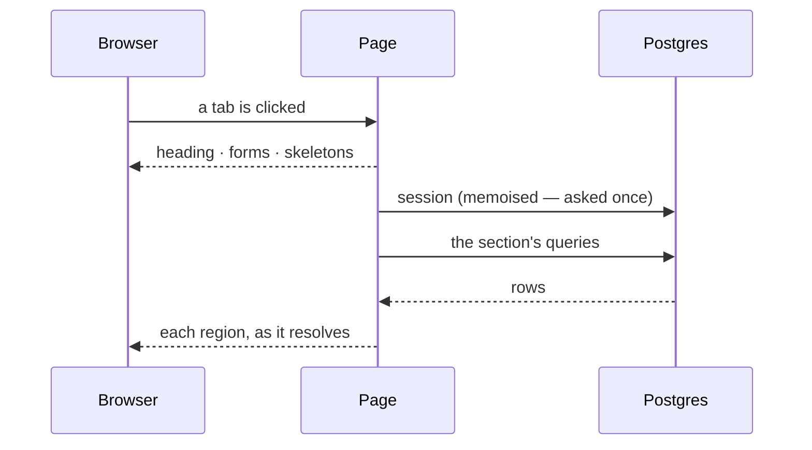

# How a section loads

What is on screen before the database answers, and why the split falls where it
does. Written for whoever adds the next section.

> **Maintenance rule.** This document is versioned with the code it describes and
> is enforced by `src/test/loading-documentation.test.ts`. Adding a section, or
> changing what one of them waits for, means changing the table below in the same
> commit. See [Keeping this document true](#keeping-this-document-true).

---

## The rule

**A page's shell never waits on a query.**

Every route behind the session gate is server-rendered on demand. A heading, a
paragraph of prose and a form do not depend on the database, so they are
returned immediately; the queries are awaited inside `<Suspense>` boundaries
drawn around the regions that actually need them.

The consequence is the point: on `/docket` the stamp form is on screen and
**usable** while the register is still being fetched. Somebody who opened the
tab to record an application they just sent can do it without waiting for a
table they were not going to read.



## Why not one skeleton for the whole page

A `loading.tsx` in the route group is the shortest way to make navigation feel
instant, and it is the wrong instrument here. It replaces **everything** inside
the folder — the title, the prose, the forms — with a placeholder, including the
parts that were ready before the request was made. Hiding finished work to
signal that other work is unfinished makes a page feel slower than it is, and it
takes away controls the person could already have been using.

So the boundaries live inside the pages, one per region that waits, and a
section with nothing to fetch has no loader at all.

## The mechanism

A page starts its queries without awaiting them and hands the promises to the
components inside the boundaries:

```tsx
// The page itself never awaits — the shell is returned at once.
const counts = requireScope().then(getEntryCounts);
const entries = requireScope().then((scope) => listEntries(scope, options));

<Suspense fallback={<FiguresSkeleton label="the counters" />}>
  <Figures counts={counts} />
</Suspense>;
```

`requireScope()` resolves through `getSession()`, which is wrapped in React's
`cache` (`src/server/auth/session.ts`). Sessions are stored rather than signed,
so every read is a round trip to Postgres; memoisation makes the several callers
in one render share a single answer, and the next request still reads fresh.

Two rules follow from the shape above:

- **Nothing on the page's own path may touch the database.** The moment a page
  awaits a query before returning JSX, every boundary under it is pointless.
- **A region owns its own wait.** Regions that share a query share the promise,
  not the boundary, so the fastest one still paints first.

## What waits, section by section

| Section       | Page                                      | Waits on                                                  |
| ------------- | ----------------------------------------- | --------------------------------------------------------- |
| Register      | `src/app/(app)/docket/page.tsx`           | counters, export links, the table                         |
| Board         | `src/app/(app)/board/page.tsx`            | the count, the columns                                    |
| Archive       | `src/app/(app)/archive/page.tsx`          | counters, the door-rate line, the table                   |
| Calendar      | `src/app/(app)/calendar/page.tsx`         | the entry selector, the month grid, the subscription card |
| Analytics     | `src/app/(app)/analytics/page.tsx`        | the findings, plan check included                         |
| Settings      | `src/app/(app)/settings/page.tsx`         | identity values, the follow-up control                    |
| Correct entry | `src/app/(app)/docket/[id]/edit/page.tsx` | the entry — the whole sheet is the row                    |
| Import        | `src/app/(app)/docket/import/page.tsx`    | —                                                         |

Import is the section worth keeping in mind when adding another: it reads
nothing, so it has no boundary, no skeleton and no spinner. A loader there would
be decoration.

Two entries in that table deserve their reasons written down:

**The calendar splits into three.** The month grid, the list of applications the
schedule form offers and the subscription link are separate queries, so they are
separate boundaries — the grid does not wait for the token. The month itself and
its arrows come from the query string, so the calendar can be paged before
anything has loaded.

**Analytics has one boundary, and its heading is not in it.** The plan check
decides whether the numbers may be computed, and it is a query. A page whose
title waits on a database read has nothing to put on screen while it waits, so
the heading is fixed and the Pro notice renders inside the boundary with the
findings it replaces.

## The shapes

`src/components/Skeleton.tsx` holds them. Three rules:

1. **Drawn at the size of what they stand in for**, so nothing moves when the
   real content lands. The board's fallback is column-shaped and 264px wide; the
   calendar's is six rows of seven cells.
2. **Never a shape for something that may not exist.** The archive's door-rate
   line is absent on an empty archive, so its fallback is nothing at all — a
   skeleton there would promise a sentence that never arrives.
3. **Labels are not placeholders.** Where a value waits beside a term that does
   not — the identity rows in Settings — the term is printed and only the value
   is a bar.

The pulse is a Tailwind animation switched off wholesale by the
`prefers-reduced-motion` block in `globals.css`, so no shape opts out on its own.

## Announcing the wait

`Placeholder` marks each fallback `role="status"` with an `aria-label` naming the
region — "Loading the register", "Loading the month" — because several can be
waiting at once and "Loading…" three times says nothing. The exception is the
identity block in Settings, where the fallback is a fragment of `<dt>`/`<dd>`
pairs inside a grid and a wrapper element would break the layout; there the
terms are read normally and the values appear when they arrive.

## What this does not fix

Streaming starts when the server starts answering. Two things happen before
that and are not addressed here:

- **In development, the first click on a route compiles it.** Turbopack
  (`pnpm dev`) is what keeps that under a second; the number is not zero.
- **Prefetching a dynamic route yields little.** `<Link>` prefetch is disabled in
  development entirely, and in production a route with no static shell has
  little to hand over in advance. The gap between the click and the first paint
  is the server's time to first byte, during which the previous page stays on
  screen — never a blank one.

## Keeping this document true

`src/test/loading-documentation.test.ts` reads the table above and fails when:

- a page named in it no longer exists;
- a section the table says waits for something has no `<Suspense>` boundary;
- a section the table marks with `—` has acquired one.

The test cannot know whether a boundary is drawn around the right region — that
is a judgement, and it belongs in review. What it does catch is the two ways
this document goes stale: a page that moves, and a section that starts or stops
waiting without anybody saying so here.
